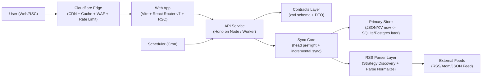
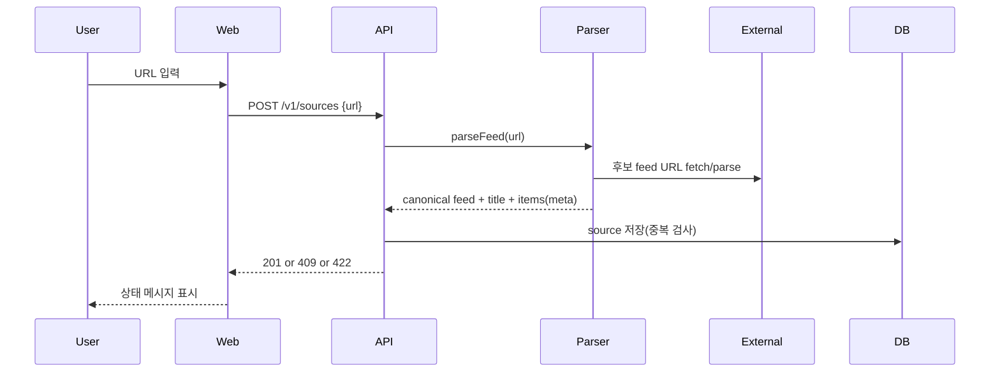
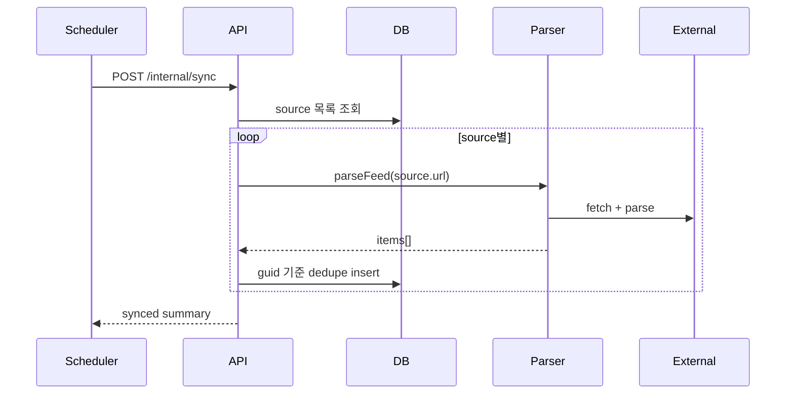

# Feedoong Atom Architecture (v0.3)

- 문서 버전: v0.3
- 작성일: 2026-02-22
- 범위: 개인 운영용 RSS 리더 MVP

## 1. 합의된 동작 기준

- 정상동작: 사용자가 URL을 등록하면 피드가 정규화 저장되고, 동기화 후 홈에서 최신순으로 읽을 수 있다.
- 현재동작: 주요 플로우는 동작하지만, 일부 외부 도메인은 원격 정책(403/429/406/404)으로 실패한다.

## 2. 설계 목표

1. 1인 운영 기준으로 단순해야 한다.
2. 코어 유저 스토리(등록/조회/동기화)를 우선 보장한다.
3. 실패 원인을 `Discovery`, `Fetch`, `Parse`, `Store` 단계로 분리해 관측 가능해야 한다.
4. 읽기 트래픽은 Edge 캐시로 흡수하고, 쓰기 정합성은 Origin에서 보장한다.

## 3. 상위 아키텍처

## 4. 컴포넌트 역할

### 4.1 Edge (Cloudflare)

1. `GET /` 및 읽기 API 응답 캐시
2. WAF/봇 방어/레이트리밋
3. 짧은 TTL + `stale-while-revalidate`로 지연/오류 완충
4. 쓰기 요청은 캐시 우회해 Origin으로 전달

### 4.2 Web (`apps/web`)

1. RSC 기반 홈 렌더링
2. 소스 등록/수동 동기화 UI
3. 상태 메시지 렌더링(`source-added`, `source-error`, `synced`, `sync-error`)

### 4.3 API (`backend/packages/api`)

1. 소스/아이템/동기화 API 제공
2. URL 등록 시 parser 레이어 호출 후 canonical feed URL 저장
3. `sync-core`를 호출하는 런타임 어댑터 역할 수행
4. 에러를 사용자 메시지로 변환

### 4.4 Contracts (`backend/packages/contracts`)

1. 요청/쿼리 zod 스키마 공통화
2. JSON body 파싱과 에러 코드(`INVALID_JSON_BODY`) 공통화
3. node API/worker 간 계약 일치 보장

### 4.5 Sync Core (`backend/packages/sync-core`)

1. HEAD preflight + 증분 동기화 로직의 단일 소스
2. 저장소/파서 의존을 포트 인터페이스로 분리
3. 런타임(node/worker) 비종속 도메인 유스케이스 제공

### 4.6 RSS Parser (`backend/packages/rss-parser`)

1. 입력 URL 기반 Discovery 전략 선택
2. 후보 feed URL 생성 및 파싱 시도
3. 파싱 결과를 내부 공통 스키마로 normalize
4. 도메인 전략 패턴으로 규칙을 격리
5. X Mentions 등 provider config는 전역 상태 대신 런타임에서 주입

### 4.7 Scheduler (`backend/packages/scheduler`)

1. Cron 트리거
2. `POST /internal/sync` 호출
3. API 키(`SCHEDULER_KEY`) 기반 내부 인증

## 5. 데이터/도메인 모델 (MVP)

### 5.1 Source

1. `id`
2. `url` (canonical feed URL)
3. `title`
4. `createdAt`

### 5.2 Item

1. `id`
2. `sourceId`
3. `guid` (없으면 `link::title` fallback)
4. `title`
5. `link`
6. `summary`
7. `publishedAt`
8. `createdAt`

## 6. 핵심 시퀀스

### 6.1 소스 등록

### 6.2 전체 동기화

## 7. Discovery/Parsing 전략 구조

1. 입력 URL을 `host/path` 기반으로 분류
2. 도메인 전략에서 후보 URL을 생성
3. 공통 fallback 전략(default) 후보를 병합
4. 후보를 순차 파싱하고 첫 성공 결과를 채택
5. 실패 시 `strategy`, `attempts`, `candidate error`를 함께 반환

현재 주요 전략:
1. `velog`
2. `naver-blog`
3. `brunch`
4. `chrome-dev`
5. `tistory`
6. `medium`
7. `youtube`
8. `default`

## 8. Edge/Origin 경계 원칙

### 8.1 Edge로 분리

1. 읽기 응답 캐시(`GET /`, `GET /v1/items`, `GET /v1/sources`)
2. 요청 차단 정책(WAF, rate limit)
3. 짧은 수명 메타 캐시(Discovery 결과 캐시)

### 8.2 Origin에 유지

1. 쓰기 정합성(등록/동기화/중복제거)
2. 스케줄 실행과 재시도 정책
3. 최종 canonical feed 결정

## 9. 캐시 정책 (권장 초안)

1. `GET /`: `s-maxage=30`, `stale-while-revalidate=120`
2. `GET /v1/items`: `s-maxage=30`, `stale-while-revalidate=90`
3. `GET /v1/sources`: `s-maxage=60`, `stale-while-revalidate=120`
4. `POST /v1/sync` 성공 시 관련 cache key/tag purge
5. 외부 피드 fetch는 내부 메모리/KV에 짧게(예: 30~120초) 완충 캐시

## 10. 장애/에러 설계

### 10.1 실패 분류

1. `DISCOVERY_ERROR`: 후보 URL 추출 실패
2. `FETCH_ERROR`: 네트워크/상태코드(403/404/406/429 등)
3. `PARSE_ERROR`: XML/피드 파싱 실패
4. `STORE_ERROR`: DB 저장 실패

### 10.2 처리 원칙

1. 소스 단위 부분 실패 허용(전체 동기화는 계속 진행)
2. 실패 로그에 `sourceId`, `strategy`, `candidate`, `status/code`, `durationMs` 기록
3. 사용자 메시지는 짧게, 운영 로그는 상세하게 분리

## 11. 관측성 (Observability)

필수 지표:
1. 동기화 성공률(소스 기준)
2. 소스당 평균 동기화 시간
3. 도메인별 실패율/실패코드 분포
4. 캐시 hit ratio
5. 홈 렌더 TTFB/P95

필수 로그 필드:
1. `traceId`
2. `sourceId`
3. `sourceHost`
4. `discoveryStrategy`
5. `candidateFeedUrl`
6. `errorType`
7. `statusCode`
8. `durationMs`

## 12. 확장 로드맵

### Phase 1 (현재)

1. JSON 저장소 + 단일 프로세스
2. 전략 패턴 기반 Discovery
3. 수동/자동 동기화

### Phase 2

1. 저장소를 SQLite/Postgres로 전환
2. Sync 작업 큐 도입(BullMQ/Cloudflare Queues 등)
3. 파서 이중화(Primary parser + Fallback parser)

### Phase 3

1. 멀티 디바이스/백업
2. 읽음/북마크
3. 추천/필터/우선순위 피드

## 13. 구현 체크리스트

1. 에러 타입 표준화(`DISCOVERY/FETCH/PARSE/STORE`)
2. sync 결과 응답에 `failedSources[]` 표준 필드 유지
3. 캐시 무효화 훅(`POST /v1/sync` 성공 후 purge)
4. 도메인 전략 테스트 fixture 추가(CSV 샘플 기반)
5. smoke 테스트에 최소 핵심 시나리오 포함
6. 아키텍처 경계 체크(`yarn check:architecture`) CI 단계에 포함
