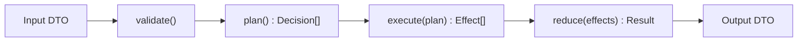

# PRD: 선언적 함수 조합 리팩토링

- 문서 버전: v0.2
- 작성일: 2026-02-22
- 범위: `apps/*`, `backend/packages/*`의 메서드 내부 구현 스타일 개선

## 0) 합의된 동작 기준

- 정상동작: 핵심 유저 스토리(소스 등록/조회/동기화)가 유지되면서, 구현은 작은 함수 조합으로 선언적으로 읽혀야 한다.
- 현재동작: 기능은 동작하지만 큰 함수 내부에서 분기/상태변경/IO가 섞여 있어 변경 시 ad hoc 수정이 유도된다.

## 1) 관측 결과 (증거)

1. 엔트리 파일이 여전히 크고 책임이 많음
   - `apps/api-worker/src/index.ts` 373 lines
   - `apps/web/app/routes/home.tsx` 348 lines
   - `backend/packages/sync-core/src/index.ts` 342 lines
2. 분기 중심 로직이 단일 함수에 집중됨
   - HEAD 판별 로직이 `backend/packages/sync-core/src/index.ts:130`~`backend/packages/sync-core/src/index.ts:243`에 집중
   - 동기화 오케스트레이션이 `backend/packages/sync-core/src/index.ts:245`~`backend/packages/sync-core/src/index.ts:342`에서 분기+IO 동시 수행
3. 라우트/액션/캐시/에러 처리의 혼재
   - `apps/web/app/routes/home.tsx:143`~`apps/web/app/routes/home.tsx:251`
4. 저장소 업데이트가 명시적 데이터 파이프라인보다 인라인 mutation 기반
   - `apps/api-worker/src/index.ts:119`~`apps/api-worker/src/index.ts:225`

## 2) 문제 정의

현재 코드는 “작동”은 하지만 “조합 가능한 단위”가 약하다.  
결과적으로 기능 추가 시:

1. 분기 삽입 위치 탐색 비용 증가
2. 로직 재사용보다 복사/수정 유도
3. 테스트가 유스케이스 단위가 아닌 엔드포인트 통합 검증에 치우침

## 3) 목표

1. 메서드 내부를 작은 순수 함수 조합으로 재구성
2. 흐름을 “데이터 변환 파이프라인”으로 선언적으로 표현
3. IO/분기/상태변경을 단계적으로 분리
4. 일반 연산(맵/필터/리듀스/룰 평가) 비중을 높이고, 도메인 규칙은 마지막 단계에서 얇게 합성
5. 동작 동일성 유지(회귀 없음)

## 4) 비목표

1. 신규 기능 추가
2. 저장소 기술 교체(DB 마이그레이션)
3. UI 레이아웃 변경

## 5) 설계 원칙 (선언적 스타일 가이드)

1. 함수는 `한 가지 결정` 또는 `한 가지 변환`만 담당
2. `if/else` 체인은 decision table(맵/룰 배열) 우선
3. `Input -> Transform -> Output` 순수 함수 우선, IO는 가장 바깥으로 이동
4. 파이프라인 단계는 이름 있는 함수로 분리
5. 메서드 내부에서 mutable 상태 누적을 최소화하고, 반환값으로 전달
6. 런타임 의존(`fetch`, `env`, `clock`)은 포트 주입
7. 구현 순서 고정: `일반 연산 조합 -> 도메인 규칙 부착 -> 런타임 연결`

## 5.1) 추상화 계층 모델 (네가 원하는 스타일의 명문화)

1. L0: 일반 연산 프리미티브
   - `map`, `filter`, `reduce`, `groupBy`, `partition`, `matchRules`, `safeParse`, `toResult`
   - 도메인 용어 금지(`source`, `feed`, `sync` 같은 이름 금지)
2. L1: 조합기(combinator)
   - L0를 엮어 재사용 가능한 패턴 제공
   - 예: `runPipeline`, `collectSuccessAndFailure`, `evaluateRules`, `applyIf`
3. L2: 도메인 규칙
   - L1 조합기에 룰 데이터만 주입
   - 예: HEAD 판정 룰, dedupe 키 규칙, intent 핸들러 레지스트리
4. L3: 런타임 어댑터
   - 실제 IO(`fetch`, DB/KV, Request/Response) 연결
   - 비즈니스 판단 금지, L2 호출만 수행

## 5.2) 코드 형태 가이드

1. 금지: 거대 함수에서 `조건판정 + IO + 데이터변환` 동시 수행
2. 권장: `const result = pipe(input, stepA, stepB, stepC)` 형태
3. 권장: 도메인 규칙은 “함수”보다 “데이터(룰 배열)”로 우선 표현
4. 권장: 예외를 던지기보다 `Result`(성공/실패) 값으로 다루고 마지막 경계에서만 에러 변환

## 5.3) 참조 템플릿

```ts
// L0
const mapItems = <T, R>(items: T[], f: (v: T) => R) => items.map(f);
const filterItems = <T>(items: T[], p: (v: T) => boolean) => items.filter(p);

// L1
const runPipeline = <T>(input: T, steps: Array<(x: T) => T>) =>
  steps.reduce((acc, step) => step(acc), input);

// L2 (도메인)
const normalizeFeedItems = (items: Item[]) =>
  runPipeline(items, [
    (x) => filterItems(x, hasLink),
    (x) => mapItems(x, toNormalizedItem)
  ]);
```

## 5.4) 외부 라이브러리 채택 기준

1. `remeda`
   - 목적: L0/L1 일반 연산(`pipe`, `map`, `filter`, `groupBy`, `partition`) 표준화
   - 채택 범위: `sync-core`, `api-worker` 저장소 변환, `web` loader/action 데이터 가공
2. `ts-pattern`
   - 목적: 분기 로직을 룰 매칭으로 선언화, 누락 케이스를 컴파일 타임에 강제
   - 채택 범위: HEAD 판정 룰, intent 핸들러 라우팅, parser provider 선택
3. `neverthrow`
   - 목적: 예외 흐름을 `Result` 체인으로 전환해 파이프라인 합성 강화
   - 채택 범위: parser 시도 파이프라인, sync 단계별 실패 축적/집계

채택 원칙:
1. 위 3개 외 신규 FP 라이브러리 추가는 금지(학습/운영 복잡도 통제)
2. 라이브러리 사용 전후로 함수 수, 분기 수, 테스트 난이도 개선을 수치로 남김

## 6) 목표 아키텍처 (함수 조합 관점)



## 7) 작업 범위

## Workstream A: Sync Core 선언화

대상:
- `backend/packages/sync-core/src/index.ts`

작업:
1. `checkSourceByHead`를 규칙 테이블 기반 evaluator로 분리
2. HEAD 판정 규칙을 “룰 데이터 + 공통 evaluator”로 변경
3. `syncOneSource`를 `planSync -> executeSyncPlan -> buildSyncDetail`로 분리
4. `syncAllSources`를 `map(async) + collectResult` 형태로 분리
5. `ts-pattern`으로 HEAD 판정 분기를 매칭식으로 전환
6. `neverthrow` 기반 `Result` 조합으로 실패 누적/성공 집계 파이프라인 구축

완료 기준:
1. `sync-core` 공개 함수(`syncOneSource`, `syncAllSources`) 본문은 orchestration만 수행
2. 내부 분기 로직이 네이밍된 작은 함수들로 분해됨
3. 도메인 함수가 L0/L1 일반 연산 유틸을 재사용
4. 예외 throw는 런타임 경계로 제한되고 core 내부는 `Result` 반환 우선

## Workstream B: Worker 저장소 어댑터 선언화

대상:
- `apps/api-worker/src/index.ts`

작업:
1. KV read/write, source mutation, item insert를 순수 변환 함수로 분리
2. 라우트 핸들러는 `parse -> usecase -> serialize` 3단계만 남김
3. 중복 response shape 생성 로직을 응답 빌더로 통합
4. 저장소 reducer 이벤트를 선언형(`type + payload`)으로 정의
5. 컬렉션 변환은 `remeda` 조합으로 통일

완료 기준:
1. 라우트 핸들러당 핵심 로직 15줄 내
2. 저장소 변경은 `nextStorage = reducer(prevStorage, event)` 패턴 사용
3. 수동 `for`/임의 mutation 루프를 구조적 변환 조합으로 치환

## Workstream C: Web Route 액션/로더 선언화

대상:
- `apps/web/app/routes/home.tsx`

작업:
1. loader/action 내부 로직을 command map으로 분리
2. API 호출/캐시 정책/에러 매핑을 데이터 접근 모듈로 이동
3. UI 렌더 함수는 표시 로직만 유지
4. intent 라우팅을 switch가 아닌 registry 데이터로 표현
5. intent 분기는 `ts-pattern` 또는 선언형 맵으로 일관화

완료 기준:
1. `loader`, `action`은 “조합 호출 + return” 수준으로 축소
2. intent 분기는 declarative command registry(`intent -> handler`)로 변환

## Workstream D: Parser 파이프라인 선언화

대상:
- `backend/packages/rss-parser/src/index.ts`

작업:
1. candidate 순회 + 파싱 시도를 `attemptPipeline(candidates, parsers)` 형태로 추상화
2. 에러 축적/최종 메시지 생성을 분리
3. provider 선택을 “protocol -> parser” 매핑 테이블로 선언화
4. 파서 시도 흐름은 `neverthrow` 체인으로 구성

완료 기준:
1. `parseFeed` 본문에서 분기 중첩 감소
2. provider 추가 시 파이프라인 구성 변경만으로 동작

## Workstream E: 강제 규칙

대상:
- 레포 전역

작업:
1. 아키텍처 체크 스크립트 확장
2. 함수 길이/복잡도 가드 추가(ESLint 또는 custom check)
3. 일반 연산 재사용 비율 리포트 스크립트 추가
4. `if/switch` 사용 제한 규칙(도메인 경계 함수 외 경고/실패) 추가
5. `remeda/ts-pattern/neverthrow` 미사용 시 대체 사유를 PR 템플릿에 기록

완료 기준:
1. CI에서 선언형 규칙 위반 차단
2. PR에서 수치 리포트 제공

## 8) 정량 목표 (Definition of Done)

1. 함수 길이
   - 신규/수정 함수: 기본 20라인 이하 (예외는 주석으로 사유 명시)
2. 복잡도
   - Cyclomatic Complexity 6 이하
3. 분기 중첩
   - 중첩 depth 2 이하
4. 엔트리 파일 축소
   - `apps/api-worker/src/index.ts` 373 -> 220 이하
   - `apps/web/app/routes/home.tsx` 348 -> 220 이하
5. 일반 연산 비중
   - 신규/수정된 유스케이스 코드 기준 L0/L1 재사용 호출 비율 70% 이상
   - 직접 조건 분기(`if/switch`)는 도메인 경계 함수에만 허용
6. 동작 보장
   - 기존 스모크 + `HEAD unchanged -> skipped` 시나리오 통과
7. 라이브러리 활용
   - `sync-core` 주요 흐름에서 `remeda`, `ts-pattern`, `neverthrow` 최소 1회 이상 실사용

## 9) 테스트 전략

1. 유닛: 순수 변환 함수(결정 함수, reducer, mapper) 우선
2. 계약: `@feedoong/contracts` 스키마 회귀 테스트
3. 통합: 핵심 유저 시나리오 3개(등록/조회/동기화)
4. 회귀: 기존 배포 경로(`api-worker`, `web`) smoke

## 10) 리스크 및 대응

1. 리스크: 함수 분해 중 동작 분기 누락
   - 대응: 분기 케이스를 golden test로 고정 후 리팩토링
2. 리스크: 과도한 추상화로 가독성 저하
   - 대응: 레이어 3단계 이상 깊어지면 중단하고 합성 단위 재조정
3. 리스크: 일정 초과
   - 대응: Workstream 단위로 순차 머지, 각 단계에서 배포 가능 상태 유지

## 11) PR 단위 제안

1. PR-1: 라이브러리 도입(`remeda`, `ts-pattern`, `neverthrow`) + 기준선 테스트
2. PR-2: Sync Core 함수 분해 + `Result` 파이프라인 전환
3. PR-3: Worker 라우트/저장소 선언화(`remeda` 변환 통일)
4. PR-4: Web loader/action command map + pattern matching 전환
5. PR-5: Parser 시도 파이프라인 `Result`화
6. PR-6: lint/check 가드 + 문서 최종화
