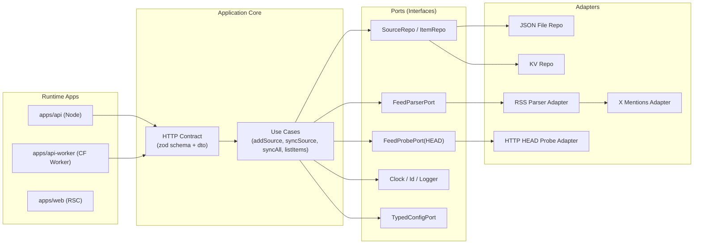

# Feedoong Atom 리팩토링 PRD (저결합/선언적 합성)

- 문서 버전: v0.1
- 작성일: 2026-02-22
- 작성 목적: 대규모 기능 추가 전에 모듈 결합도를 낮추고 변경 내성을 높이는 구조로 전환

## 1) 정상동작/현재동작 합의

- 정상동작: 기능 추가 시 기존 모듈 수정 없이 독립 모듈을 선언적으로 조합해 배포 가능해야 한다.
- 현재동작: 핵심 플로우는 동작하지만, 런타임/도메인/인프라 코드가 섞여 변경 시 연쇄 수정이 자주 필요한 구조다.

## 2) 현재 관측 (증거 기반)

### 2.1 API 런타임 코드의 단일 파일 집중

- `apps/api-worker/src/index.ts`는 603라인이며 라우팅, 저장소, 동기화, HEAD preflight, env 주입이 한 파일에 공존한다.
- 동일 성격의 책임이 `backend/packages/api/src/server.ts`, `backend/packages/api/src/sync.ts`, `backend/packages/api/src/db.ts`로 분리되어 있지만 worker 쪽은 재구현 형태다.

### 2.2 로직 중복으로 인한 결합 상승

- `checkSourceByHead`, `isHttpFeedSource`, `normalizeHeaderValue`, `syncOneSource/syncAllSources`가 `apps/api-worker/src/index.ts`와 `backend/packages/api/src/sync.ts`에 중복 존재한다.
- 요청 스키마/에러 처리(`sourceBodySchema`, `syncBodySchema`, `INVALID_JSON_BODY_ERROR`)도 node API와 worker에 중복된다.

### 2.3 전역 상태와 환경 의존 누수

- X 멘션 파서는 `globalThis.__FEEDOONG_X_*`와 `process.env`를 직접 읽는다.
  - 파일: `backend/packages/rss-parser/src/providers/x-mentions.ts`
- 웹도 API service binding을 `globalThis.__FEEDOONG_API_SERVICE`에 의존한다.
  - 파일: `apps/web/app/routes/home.tsx`, `apps/web/worker-entry.ts`

### 2.4 런타임 세부사항이 도메인 흐름에 침투

- Cloudflare 캐시 옵션(`requestInit.cf`)과 API 호출/액션 로직이 화면 라우트 파일에 직접 섞여 있다.
  - 파일: `apps/web/app/routes/home.tsx`

## 3) 문제 정의

현재 구조는 “도메인 유스케이스”보다 “런타임 별 구현”이 중심이어서, 기능 추가 시 다음이 반복된다.

1. node API와 worker 양쪽에 동일 로직을 별도 수정
2. 전역/env 접근 규칙이 분산되어 테스트/재현 경로 복잡화
3. 새 전략/새 저장소 추가 시 수정 지점이 넓어져 ad hoc 패치 증가

## 4) 목표

1. 도메인 유스케이스를 런타임(node/worker/web)에서 독립시킨다.
2. 의존을 “포트/어댑터”로 제한해 모듈 합성을 선언적으로 만든다.
3. API 계약과 핵심 사용자 시나리오(등록/조회/동기화/증분+HEAD)를 유지한다.
4. 리팩토링 동안 기능 회귀를 수치/테스트로 검증한다.

## 5) 비목표 (이번 리팩토링에서 제외)

1. 데이터스토어를 즉시 Postgres로 전환
2. UI/UX 대대적 개편
3. 신규 기능 대량 도입(추천, 소셜 그래프 등)

## 6) 리팩토링 원칙

1. `1 PR = 1 해결책 + 증거` 원칙
2. 런타임 레이어는 조합(Composition Root)만 수행
3. 도메인 레이어는 `hono`, `KV`, `process.env`, `globalThis`에 직접 의존 금지
4. 구성은 코드 기반 선언형 manifest로 관리
5. 기존 API 응답 스키마 호환을 기본값으로 유지

## 7) 목표 아키텍처 (선언적 합성)

## 8) 모듈 설계안

### 8.1 신규 패키지 제안

1. `backend/packages/core`
   - 도메인 타입: `Source`, `FeedItem`, `SyncDetail`
   - 유스케이스: `addSource`, `syncOneSource`, `syncAllSources`, `listSources`, `listItems`
   - 규칙: dedupe, HEAD preflight decision, sync 상태 계산
2. `backend/packages/contracts`
   - 요청/응답 zod schema + DTO + 에러 코드
   - node API/worker/web가 동일 계약 참조
3. `backend/packages/adapters-*`
   - `adapters-repo-json`, `adapters-repo-kv`
   - `adapters-parser-rss`
   - `adapters-probe-http`
4. `backend/packages/config`
   - env 파싱/검증 단일화 (`zod`)
   - `globalThis/process.env` 직접 접근 금지, 런타임에서 주입

### 8.2 선언적 전략 레지스트리

1. 도메인별 파서/발견 전략을 manifest 배열로 등록
2. 전략 선택은 순수 함수(`match -> resolve -> parse`) 체인으로 구성
3. X 멘션도 동일 전략 인터페이스를 따르되, 인증/요청은 adapter로 분리

## 9) 단계별 실행 계획

## Phase 0. 기준선 고정 (1주)

1. 현재 API 응답 계약을 contract test로 고정
2. 핵심 유저 시나리오 smoke 작성
   - 소스 등록
   - 전체 동기화
   - 2회 동기화 시 HEAD unchanged -> `status=skipped`
3. 중복 지표/파일 복잡도 baseline 기록

완료 기준

1. 회귀 감지 가능한 자동 테스트 최소 1세트
2. 현재 응답 스키마 snapshot 확보

## Phase 1. Sync 코어 추출 (1~2주)

1. `sync` 관련 순수 로직을 `backend/packages/core`로 이동
2. node API/worker는 core usecase만 호출하도록 축소
3. 저장소 접근은 repo interface로 치환

완료 기준

1. `checkSourceByHead/syncOneSource/syncAllSources` 중복 제거
2. node/worker의 sync 결과가 동일 테스트를 통과

## Phase 2. HTTP 계약/라우트 분리 (1주)

1. 요청/응답 schema를 `contracts`로 통합
2. 라우트는 `createRoutes({ usecases, contract, auth })` 형태로 팩토리화
3. 에러 매핑 정책을 공통화

완료 기준

1. node API/worker의 route-level 중복 제거
2. 계약 변경 시 수정 지점이 1곳(contracts)으로 수렴

## Phase 3. 파서/전략 의존성 정리 (1~2주)

1. `x-mentions`에서 `globalThis/process.env` 직접 참조 제거
2. parser adapter 생성 시 config 주입 방식으로 전환
3. 전략 레지스트리를 선언형 manifest로 통일

완료 기준

1. parser 패키지에서 런타임 전역 접근 제거
2. 신규 전략 추가 시 수정 파일 2개 이내(전략 파일 + manifest)

## Phase 4. 경계 강제/운영 지표 (1주)

1. lint rule 또는 dependency rule로 금지 import 강제
2. 변경 리드타임/회귀율 관측 지표 추가
3. 문서(`ARCHITECTURE.md`) 최신화

완료 기준

1. 아키텍처 경계 위반 CI 차단
2. 리팩토링 전후 지표 비교 가능

## 10) 수용 기준 (Definition of Done)

1. 기능 동작
   - 기존 핵심 시나리오 모두 pass
   - HEAD preflight 증분 동작 유지
2. 구조 품질
   - 도메인 로직의 node/worker 중복 0
   - 런타임 엔트리 파일 크기 축소
     - `apps/api-worker/src/index.ts` 603라인 -> 250라인 이하
3. 의존성 품질
   - core/domain에서 `hono`, `node:*`, `KV`, `globalThis`, `process.env` 직접 참조 0
4. 확장성
   - 신규 전략 추가에 필요한 수정 지점이 명확하고 문서화됨

## 11) 리스크 및 대응

1. 리스크: 동작은 같아도 응답 shape가 미세하게 바뀔 수 있음
   - 대응: 계약 테스트 + snapshot 비교
2. 리스크: 단계 병행 중 중복 코드가 일시 증가
   - 대응: phase 종료마다 dead code 제거 PR 분리
3. 리스크: 일정 지연
   - 대응: 기능 추가는 phase 경계에서만 병합, 긴급 기능은 adapter 레이어에 한정

## 12) 작업 분할 가이드 (PR 단위)

1. PR-1: contracts 패키지 도입 + 기존 라우트에서 참조
2. PR-2: core sync usecase 추출 + node API 연결
3. PR-3: worker를 core/usecase로 전환
4. PR-4: parser config 주입화(global 제거)
5. PR-5: dependency rule + 문서 업데이트

## 13) 오픈 질문

1. core 패키지 네이밍을 `core` vs `application` 중 무엇으로 고정할지
2. 계약 안정성 우선순위를 `REST shape 고정` vs `에러 코드 재정비` 중 어디에 둘지
3. web 라우트의 API 호출/캐시 로직을 별도 data-access 모듈로 분리할 범위
