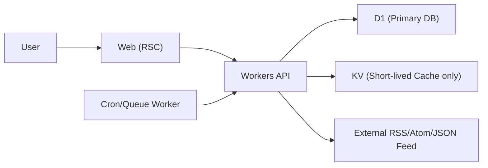

# PRD: Storage Cost Optimization with Cloudflare (RPI)

- 문서 버전: v0.1
- 작성일: 2026-02-28
- 범위: Feedoong Atom 저장소/인프라 비용 최적화
- 대상 단계: MVP -> 소규모 멀티유저 초기

## 1) 문제 정의

- 현재 구조는 개인 운영 MVP로는 충분하지만, 저장소가 JSON/KV 중심이라 멀티유저/동시성/정합성 요구가 올라가면 운영비(장애 대응 인건비 포함)가 급격히 증가할 수 있다.
- "무료처럼 보이는 구성"이 실제로는 sync write 패턴에서 한계를 빨리 맞아 총비용(TCO)이 높아질 위험이 있다.
- 비관계형 단일 문서 저장소를 운영 DB처럼 쓰는 접근은 쓰기 충돌/정합성/복구 비용 때문에 장기적으로 총비용이 커질 수 있다.

## 2) 합의할 동작 기준

- 정상동작: 사용자 수와 소스 수가 늘어도 RSS 동기화/조회가 정합성을 유지하면서 월 고정비를 낮게 통제한다.
- 현재동작: 단일 사용자 기준은 동작하지만 저장소 계층이 멀티유저/고빈도 sync에 최적화되어 있지 않다.

## 3) 목표

1. 월 고정비 최소화(초기 Free tier 최대 활용, Paid 전환 시에도 예측 가능).
2. RSS 도메인 핵심(파싱 내구성 + sync 전략)을 해치지 않는 저장소 구조로 전환.
3. 멀티유저 로그인 도입 전제의 데이터 분리(`user_id` 스코프) 준비.

## 4) 비목표

1. UI/UX 개편
2. 추천/소셜 기능 추가
3. 대규모 엔터프라이즈 수준 다중 리전 active-active

## 5) 핵심 의사결정

1. 주 저장소는 `Cloudflare D1`로 통일한다.
2. `Cloudflare KV`는 "짧은 TTL 캐시/락 보조" 용도로만 제한한다.
3. 운영 데이터 write path는 DB 단일 경로로 고정한다.

## 6) 비용 가드레일 (2026-02-28 확인)

아래 수치는 모두 "공식 문서 기준, 추후 변경 가능" 전제로 관리한다.

1. Workers
- Free: `100,000 requests/day`
- Paid: 최소 `$5/month` + 사용량 과금

2. D1
- Free: `rows read 5 million/day`, `rows written 100,000/day`, `storage 5 GB`
- 초과 시 Workers Paid 전환 후 사용량 과금

3. KV
- Free: `keys written 1,000/day`, `keys read 100,000/day`, `storage 1 GB`
- 결론: RSS sync 주 저장소로는 부적합(쓰기 한계가 낮음)

4. Queues (선택)
- Free: `10,000 operations/day`, 보관 `24 hours`
- 고빈도 sync/재시도 분리 필요 시에만 도입

## 7) 제안 아키텍처

원칙:
1. 정합성 필요한 write path는 항상 D1으로 직행.
2. 캐시는 손실 허용 데이터만 KV 사용.
3. 장애 복구는 정기 export + migration script로 수행.

## 8) RSS 도메인 관점의 저장소 설계 포인트

1. 파싱 결과 저장
- `source_id`, `discovery_strategy`, `candidate_url`, `etag`, `last_modified`, `last_error_type`를 저장해 재시도 비용을 낮춘다.

2. sync 상태 저장
- `next_check_at`, `error_count`, `retry_after`, `last_synced_at`를 소스 단위로 유지한다.
- `429/503` + `Retry-After`를 반영해 소스별 backoff를 적용한다.

3. 아이템 dedupe
- `(user_id, source_id, guid_hash)` 유니크 키로 중복 삽입 방지.
- `published_at DESC` 조회 인덱스로 피드 홈 비용을 낮춘다.

## 9) 구현 계획 (RPI)

## Research

완료 기준:
1. 기존 JSON/KV write 경로와 쿼리 패턴을 계측해 일별 read/write량 산출
2. Free tier 초과 가능 구간(피크 시간, sync 폭주) 식별

산출물:
1. `일별 rows read/write` 추정치
2. KV write 사용량 보고서

## Plan

완료 기준:
1. D1 스키마/인덱스/마이그레이션 순서 정의
2. 롤백 절차(최근 export restore) 문서화

작업:
1. `sources/items/sync_state/users/sessions` 테이블 설계
2. 기존 저장소 -> D1 dual-write 기간 계획
3. 캐시 무효화 전략(`POST /v1/sync` 후 purge) 확정

## Implement

완료 기준:
1. D1 단일 write 경로 전환
2. KV가 캐시 외 용도로 호출되지 않음
3. smoke + sync 회귀 테스트 통과

검증:
1. before/after 월 비용 추정 비교
2. 동시 sync 재현 시 중복/유실 0건
3. 장애 복구 리허설 1회 이상

## 10) 단계별 롤아웃

1. Phase 0: 계측 먼저
- sync당 rows read/write, 외부 fetch 수, 실패율 계측

2. Phase 1: D1 도입
- 읽기/쓰기 모두 D1 우선, KV는 캐시 한정으로 축소

3. Phase 2: 백업 체계
- 일 1회 D1 export 생성 + 보존 정책 적용

4. Phase 3: 큐 분리(필요 시)
- 동시성 폭주 구간에서만 Queues로 sync fan-out 제한

## 11) 수용 기준 (DoD)

1. 저장소 레이어 기준 월 고정비가 예측 가능한 범위로 유지된다.
2. Free tier 초과 시점이 지표로 사전 감지된다.
3. 사용자/소스/아이템 정합성 문제가 재현 테스트에서 0건이다.
4. 운영 데이터는 DB 단일 경로로 저장된다.

## 12) 운영 체크리스트

1. 월 1회 가격표 재검증(공식 문서 링크 확인)
2. D1 인덱스 효율 점검(`rows_read` 급증 여부)
3. sync 실패 상위 도메인(403/429/503) 별 backoff 파라미터 조정
4. 백업 복구 리허설 분기 1회

## 13) 근거 링크

1. Workers Pricing: https://developers.cloudflare.com/workers/platform/pricing/
2. D1 Pricing: https://developers.cloudflare.com/d1/platform/pricing/
3. Queues Pricing: https://developers.cloudflare.com/queues/platform/pricing/
4. KV Pricing(Workers 내): https://developers.cloudflare.com/workers/platform/pricing/
